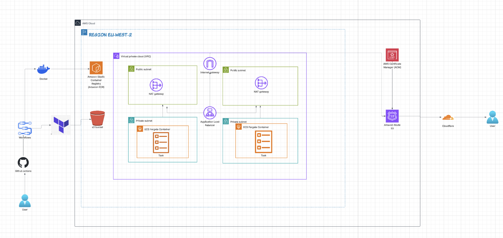
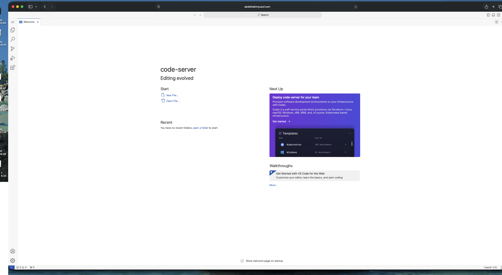
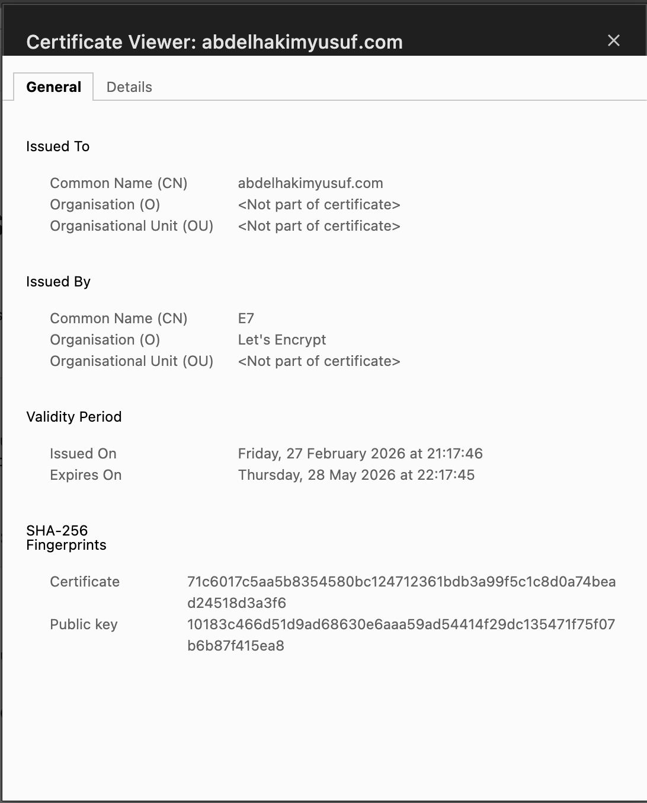
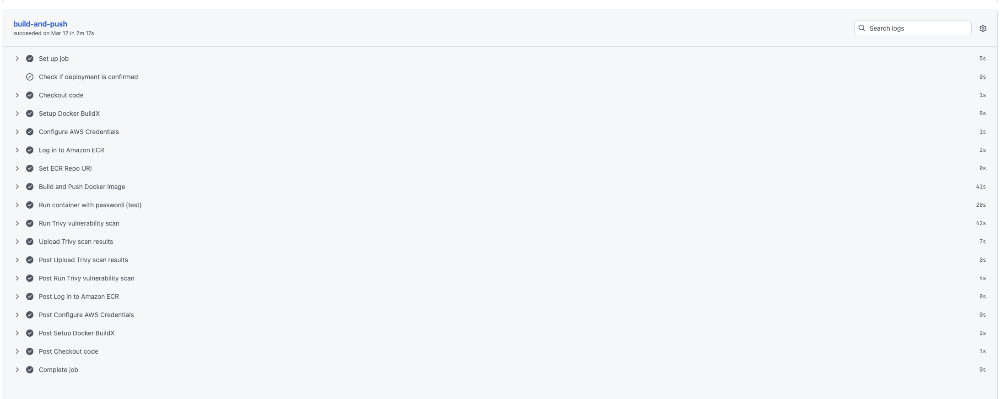
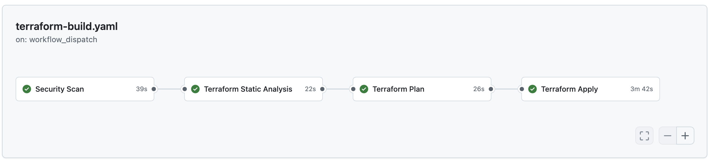
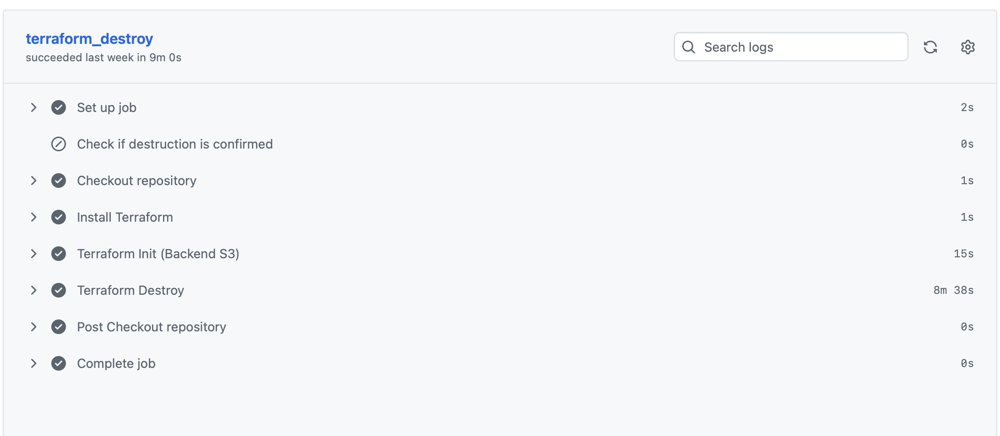

## Deploying AWS code-server Application 

## Introduction 

This project deploys code-server on AWS ECS Fargate, providing a browser-based VS Code environment for remote development. Infrastructure is managed using Terraform, and GitHub Actions automates building the Docker image, pushing it to Amazon ECR, and deploying updates, enabling a fully containerised and streamlined workflow.

## AWS Architecture Diagram



## Project Structure  

```
├── .github/
│   └── workflows/
│       ├── docker-push.yaml
│       ├── terraform-build.yaml
│       └── terraform-destroy.yaml
├── code-server/
│   ├── Dockerfile
│   └── .dockerignore
├── images/
├── infra/
│   ├── modules/
│   │   ├── acm/
│   │   │   ├── main.tf
│   │   │   ├── output.tf
│   │   │   └── variables.tf
│   │   ├── alb/
│   │   │   ├── main.tf
│   │   │   ├── output.tf
│   │   │   └── variables.tf
│   │   ├── ecs/
│   │   │   ├── main.tf
│   │   │   ├── output.tf
│   │   │   └── variables.tf
│   │   ├── security groups/
│   │   │   ├── main.tf
│   │   │   ├── output.tf
│   │   │   └── variables.tf
│   │   └── vpc/
│   │       ├── main.tf
│   │       ├── output.tf
│   │       └── variables.tf
│   ├── main.tf
│   ├── output.tf
│   ├── provider.tf
│   ├── terraform.tfvars
│   └── variables.tf
├── .gitignore
└── readme.md
```

## Prerequisites 

* AWS account with CLI configured and 2FA enabled
* Terraform installed
* Docker installed
* GitHub repository with Actions enabled
* AWS IAM permissions for ECS, ECR, VPC, ALB, ACM, and IAM roles

## Setup locally 
```
npm install 
npm run build 
npm start 

then visit: http://localhost:3000
```

## CI/CD Pipeline 

This project uses GitHub Actions for automated deployment:
1. Docker Build & Push (docker push workflow)
* Builds the code-server Docker image using a multi-stage build to reduce image size and improve efficiency
* Runs Trivy security scanning to detect vulnerabilities in dependencies and container layers
Tags and pushes the validated image to Amazon ECR
2. Infrastructure Deployment (terraform apply workflow)
* Initialises Terraform
* Creates an execution plan
* Applies infrastructure changes to AWS (ECS, ALB, VPC, ACM, etc.)
* Deploys or updates the running code-server service on ECS Fargate
3. Infrastructure Destruction (terraform destroy workflow)
* Safely tears down all AWS resources created by Terraform

To trigger all workflows, go to github and click on the repository and click the top for github actions and manually run the desired workflow.

## Setup

# AWS Setup

1. AWS Setup

Ensure the following are configured before deployment:
* AWS Account with sufficient permissions
* AWS CLI installed and configured
* Terraform (v1.0+) installed
* Docker installed locally

2. AWS Credentials (Access Keys)

Set the following environment variables locally and in GitHub Secrets:
* AWS_ACCESS_KEY_ID
* AWS_SECRET_ACCESS_KEY
* AWS_REGION


3. Domain Configuration

You will need a domain and DNS setup:
* Register a domain 
* Configure DNS records for your application
* (Optional) Use Cloudflare for DNS management and SSL

If using Cloudflare locally, configure:
* CLOUDFLARE_API_TOKEN
* CLOUDFLARE_ZONE_ID


# Terraform Configuration

Before deploying, update the Terraform configuration:

Deployment (infra/deployment/)
* Update terraform.tfvars:
* Domain name
* ECR repository URL
* Update provider.tf
* AWS region
* S3 backend configuration for Terraform state


# GitHub Configuration

To enable CI/CD automation, configure the following in your repository:

GitHub Secrets
* AWS_ACCESS_KEY_ID
* AWS_SECRET_ACCESS_KEY
* AWS_REGION
* ECR_REPOSITORY

These are used by GitHub Actions to authenticate with AWS and deploy infrastructure.


CI/CD Pipelines

GitHub Actions workflows automate the full deployment lifecycle:
1. * docker-push.yaml
* Builds Docker image using multi-stage Dockerfile
* Runs Trivy to scan for vulnerabilities 
* Pushes image to Amazon ECR
2. * terraform-build.yaml
* initialises the terraform directory
* Runs Terraform plan
* Validates infrastructure changes
* Applies Terraform configuration
* Deploys infrastructure to AWS
3. * terraform-destroy.yaml
* Tears down infrastructure when required


Deployment Workflow
* Push code to the repository
* GitHub Actions builds and pushes the Docker image
* Terraform plan runs automatically
* Terraform apply deploys infrastructure to AWS
* ECS service 
updates with the new container image

## Deployment Steps

### Step 1: Configure GitHub Secrets

In your GitHub repository:

1. Go to **Settings → Secrets and variables → Actions**
2. Add the following secret:
   - `ECR_REPOSITORY` – your Amazon ECR repository URL

---

### Step 2: Deploy Infrastructure

1. Go to the **Actions** tab in your repository  
2. Run **terraform apply** workflow  
3. Review the plan (optional)  
4. Confirm and execute the deployment  

This will provision all AWS resources (VPC, ALB, ECS, ACM, Security Groups).

---

### Step 3: Deploy Application Updates

To update the application:

1. Make changes to the project  
2. Push to the `main` branch  

This automatically triggers:
- Docker multi-stage build  
- Trivy security scan  
- Push to Amazon ECR  
- ECS service update with the new image  

---

### Step 4: Access the Application

Once deployment is complete:

- Use the **ALB DNS name** from Terraform output  
- Or your **custom domain** (if configured with HTTPS)  

---

### Step 5: Destroy Infrastructure (Optional)

To remove all resources:

1. Go to the **Actions** tab  
2. Run **terraform destroy** workflow  

---

<br>

|Here's a picture of the working application:|
|-------|
|  |

|The SSL Certificate:|
|-------|
|  |

|Docker Build Pipeline:|
|-------|
|  |

|Terraform Plan Pipeline:|
|-------|
|  |


|Terraform Destroy Pipeline:|
|-------|
|  |

